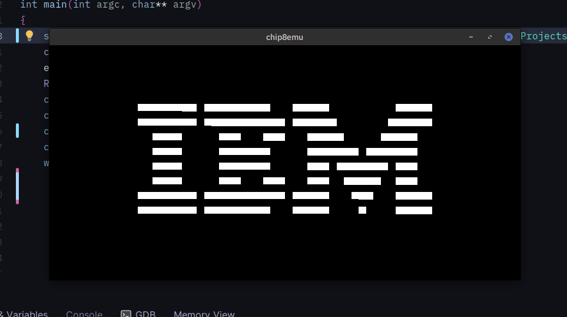

# Chip-8 emulator

Chip-8 is an interpreted programming language first supported by COSMIC VIP and Telmac 1800 (which were 8bit computers) in the mid 1970s.
It is a very simple language with only 35 opcodes.

Writing this project to refresh and learn more C++, which is more employable nowadays.

Goals
- [ ] add tests
- [x] C++17-ify the code to max
- [ ] Add imGUI to show system state, pause execution, change speed etc.
- [ ] add documentation
- [ ] run roms from the internet unprotected

The goal of this project is to write a emulator following C++17 standards.

IBM test rom to test display and a few other instructions


# Build :
```bash
cmake -B build
cd build
make 
./chip8 [path to rom]
```

# good rom collection
https://github.com/kripod/chip8-roms

# Reference :
- https://tobiasvl.github.io/blog/write-a-chip-8-emulator/
- https://en.wikipedia.org/wiki/CHIP-8

Because they don't spoon feed implementation, only give high level specification and instructions. Leaving the fun part to me 😋
